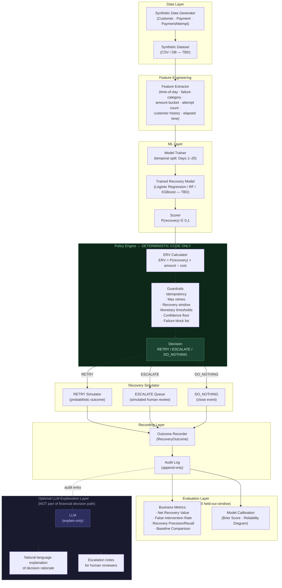

# ARCHITECTURE.md — Revenue Recovery Decision Engine

**Status:** Proposed — Not Yet Implemented
**Last Updated:** 2026-08-31

---

## Overview

The system is a batch decision pipeline. It is NOT a real-time payment processor.
It operates over synthetic data to demonstrate an AI-assisted revenue recovery decision framework.

All components described here are proposed. Concrete technology choices are recorded separately in `DECISIONS.md`.

---

## System Architecture Diagram



---

## Component Descriptions

### Synthetic Data Generator

Generates realistic but entirely fake payment transaction data.

Responsibilities:
- Create `Customer` records with segments (Consumer / SME / Enterprise) and historical success rates.
- Create `Payment` records with amounts, methods, and timestamps across a 30-day window.
- Create `PaymentAttempt` records with randomized outcomes (success / fail).
- Assign failure reasons from a taxonomy (insufficient funds, timeout, bank decline, card expired, fraud flag, account closed, etc.).
- Embed temporal patterns: higher failure rates at certain hours, certain payment methods, etc.
- Generate a ground truth `is_recoverable` label for evaluation purposes.

**This component uses no external APIs and processes no real data.**

---

### Feature Extractor

Transforms raw entity fields into a flat feature vector suitable for the ML model.

Planned features (subject to revision during implementation):

| Feature | Source |
|---|---|
| `hour_of_day` | PaymentAttempt.attempted_at |
| `day_of_week` | PaymentAttempt.attempted_at |
| `failure_category` | FailureEvent.failure_category (encoded) |
| `payment_method` | Payment.payment_method (encoded) |
| `amount_log` | log(Payment.amount) |
| `amount_bucket` | binned amount range |
| `prior_attempt_count` | count of prior PaymentAttempts |
| `customer_segment` | Customer.segment (encoded) |
| `customer_historical_success_rate` | Customer.historical_success_rate |
| `days_since_account_created` | Customer.account_age_days |
| `hours_since_failure` | time elapsed since FailureEvent.failure_at |

---

### ML Model (Trainer + Scorer)

A supervised binary classifier.

- **Target label:** `did_recovery_succeed` (1 if a simulated recovery attempt for this event succeeded, 0 otherwise)
- **Train/test split:** strictly temporal (Days 1–20 train, Days 21–30 test)
- **Output:** calibrated probability score `P(recovery)`

Model family is an **open decision** (see `DECISIONS.md`). Multiple candidates will be evaluated:
- Logistic Regression — interpretable baseline
- Random Forest — non-linear, handles interactions
- XGBoost / LightGBM — typically best tabular performance

Model artifacts (serialized model + feature schema) will be versioned to enable reproducibility.

---

### Policy Engine

Pure deterministic Python code. No ML inside.

**Step 1 — ERV Calculation:**
```
ERV = P(recovery) × payment_amount − intervention_cost
```

**Step 2 — Guardrail evaluation (ordered):**
1. Idempotency check → if duplicate, emit DO_NOTHING immediately
2. Max retry count check → if exceeded, emit DO_NOTHING
3. Recovery window check → if expired, emit DO_NOTHING
4. Failure reason block list → if blocked reason, emit DO_NOTHING
5. High-value threshold → if amount > HIGH_VALUE and P(recovery) is ambiguous, emit ESCALATE
6. Confidence floor → if P(recovery) < MIN_CONFIDENCE, emit ESCALATE or DO_NOTHING
7. ERV threshold → if ERV > MIN_ERV, emit RETRY; else emit DO_NOTHING

All thresholds are loaded from a configuration file or environment variables. No magic numbers in business logic.

---

### Recovery Simulator

A lightweight simulation layer that models what happens when a decision is executed.

- **RETRY path:** Generates a probabilistic outcome (success / fail) seeded by the ground truth recovery probability from the synthetic dataset. The simulator does NOT use the ML model — it uses the true label.
- **ESCALATE path:** Records the event in a simulated human review queue. Outcome is recorded as "escalated — pending."
- **DO_NOTHING path:** Records the event as closed. No further action.

The simulator exists to produce `RecoveryOutcome` records that can be used in evaluation.

---

### Audit Log

An append-only sequence of structured log entries. Every system action writes a record.

Design goals:
- **Completeness:** Every decision and outcome is logged.
- **Immutability:** Existing entries are never modified.
- **Queryability:** The evaluation layer reads exclusively from the audit log.

The audit log is the single source of truth. If it is not in the log, it did not happen.

---

### Evaluation Layer

Reads from the audit log and computes all metrics defined in `PROJECT_SPEC.md` Section L.

Outputs:
- Business metrics table (text / JSON)
- Model calibration plot (reliability diagram)
- Baseline comparison table

This layer is read-only. It does not modify any data.

---

### Optional LLM Explanation Layer

**This component is optional and post-decision only.**

If included:
- Receives completed audit log entries as input.
- Produces natural-language explanations of why a decision was made.
- Produces escalation summaries for human reviewers.
- Has no write access to any decision or outcome record.
- Is called after the decision has been recorded — it cannot change anything.

The LLM explanation layer is shown with dashed lines in the architecture diagram to indicate it is not in the critical decision path.

---

## Deployment Constraint

- Target deployment: **Vercel** (frontend / API routes if applicable)
- AWS is explicitly excluded
- Specific deployment architecture depends on open decisions about backend and frontend frameworks

---

## Directory Structure (Proposed)

The following structure is proposed for the codebase. It is not yet created.

```
revenue-recovery/
├── PROJECT_SPEC.md          # This project specification
├── ARCHITECTURE.md          # This document
├── DECISIONS.md             # Open architectural decisions
├── README.md                # Public-facing summary
│
├── data/                    # Generated synthetic data (gitignored if large)
│   └── .gitkeep
│
├── src/
│   ├── data_generator/      # Synthetic data generation
│   ├── features/            # Feature engineering
│   ├── model/               # ML training and scoring
│   ├── policy/              # Deterministic policy engine
│   ├── simulator/           # Recovery action simulator
│   ├── audit/               # Audit log writer/reader
│   └── evaluation/          # Metrics computation
│
├── notebooks/               # Exploratory analysis (optional)
│
├── tests/                   # Unit and integration tests
│
├── config/
│   └── policy_config.yaml   # Guardrail thresholds (externalized)
│
└── scripts/                 # CLI entry points for pipeline steps
```

This structure will be refined once technology decisions are confirmed.

---

*This document describes proposed architecture only. Nothing described here is yet implemented.*
