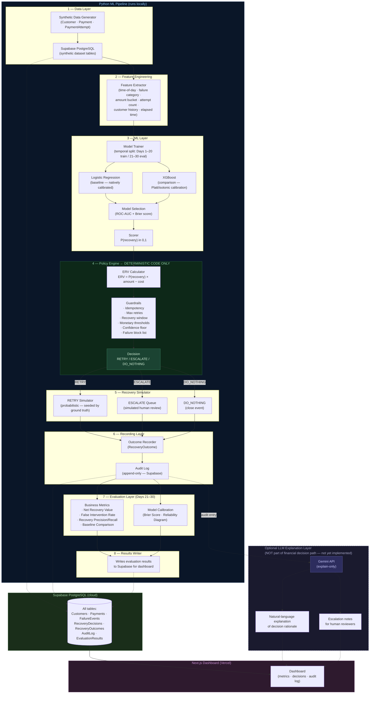

# ARCHITECTURE.md — Revenue Recovery Decision Engine

**Status:** Approved — Implementation Pending
**Last Updated:** 2026-08-31

---

## Overview

The system is a batch decision pipeline. It is NOT a real-time payment processor.
It operates over synthetic data to demonstrate an AI-assisted revenue recovery decision framework.

All technology choices are now locked (see DECISIONS.md). This document reflects those decisions.

---

## Approved Technology Stack

| Layer | Technology |
|---|---|
| ML Pipeline | Python — pandas, NumPy, scikit-learn, XGBoost |
| ML Models | Logistic Regression (baseline) + XGBoost (comparison) |
| Database | Supabase PostgreSQL |
| Python → DB | supabase-py (official Python client), bulk upserts |
| Frontend | Next.js + TypeScript + Tailwind CSS |
| Deployment | Vercel (Next.js) + Supabase (data) |
| LLM | Optional Gemini API — explanation only, not yet implemented |
| AWS | Explicitly excluded |

---

## Data Flow

```
Python ML pipeline (runs locally)
        |
        | writes pre-computed results via supabase-py
        v
  Supabase PostgreSQL (cloud)
        |
        | reads results via Supabase JS client
        v
  Next.js dashboard (Vercel)
```

The Python ML pipeline is NEVER executed inside Vercel Serverless Functions.
The Next.js frontend reads pre-computed, already-written data from Supabase.

---

## System Architecture Diagram



---

## Component Descriptions

### 1 — Synthetic Data Generator

Generates realistic but entirely fake payment transaction data. No external APIs. No real data.

Responsibilities:
- Create `Customer` records with segments (Consumer / SME / Enterprise) and historical success rates.
- Create `Payment` records with amounts, methods, and timestamps across a 30-day window.
- Create `PaymentAttempt` records with outcomes (success / fail).
- Assign failure reasons from a taxonomy (insufficient funds, timeout, bank decline, card expired, fraud flag, account closed, etc.).
- Embed temporal patterns: higher failure rates at certain hours, certain payment methods, etc.
- Generate a ground truth `is_recoverable` label — this label must encode learnable signal (not random).
- Write all generated data to Supabase via supabase-py.

---

### 2 — Feature Extractor

Transforms raw entity fields into a flat feature vector for the ML model.

Planned features (subject to revision during implementation):

| Feature | Source |
|---|---|
| `hour_of_day` | PaymentAttempt.attempted_at |
| `day_of_week` | PaymentAttempt.attempted_at |
| `failure_category` | FailureEvent.failure_category (encoded) |
| `payment_method` | Payment.payment_method (encoded) |
| `amount_log` | log(Payment.amount) |
| `amount_bucket` | binned amount range |
| `prior_attempt_count` | count of prior PaymentAttempts |
| `customer_segment` | Customer.segment (encoded) |
| `customer_historical_success_rate` | Customer.historical_success_rate |
| `days_since_account_created` | Customer.account_age_days |
| `hours_since_failure` | time elapsed since FailureEvent.failure_at |

---

### 3 — ML Model (Trainer + Scorer)

A supervised binary classifier. Two models trained and compared:

- **Logistic Regression** — baseline, natively calibrated, interpretable.
- **XGBoost** — comparison model; requires post-hoc calibration (Platt scaling or isotonic regression via `CalibratedClassifierCV`).

**Target label:** `did_recovery_succeed` (1 if the simulated recovery succeeded, 0 otherwise)
**Train/test split:** strictly temporal — Days 1–20 train, Days 21–30 evaluation. No random shuffling.
**Model selection:** evidence-based using ROC-AUC + Brier score. The better-calibrated model is used in production.
**Output:** calibrated probability score `P(recovery)` — a true probability, not a rank score.

Model artifacts (serialized model + feature schema) are versioned for reproducibility.

---

### 4 — Policy Engine

Pure deterministic Python code. No ML, no LLM, no randomness.

**Step 1 — ERV Calculation:**
```
ERV = P(recovery) × payment_amount − intervention_cost
```

**Step 2 — Guardrail evaluation (ordered):**
1. Idempotency check → if duplicate event_id, emit DO_NOTHING immediately
2. Max retry count check → if exceeded, emit DO_NOTHING
3. Recovery window check → if time since failure > window, emit DO_NOTHING
4. Failure reason block list → if blocked reason, emit DO_NOTHING
5. High-value threshold → if amount > HIGH_VALUE and P(recovery) ambiguous, emit ESCALATE
6. Confidence floor → if P(recovery) < MIN_CONFIDENCE, emit ESCALATE or DO_NOTHING
7. ERV threshold → if ERV > MIN_ERV, emit RETRY; else emit DO_NOTHING

All thresholds are loaded from config/policy_config.yaml. No magic numbers in business logic.

---

### 5 — Recovery Simulator

Models what happens when a decision is executed.

- **RETRY:** Generates a probabilistic outcome seeded by ground truth `is_recoverable`. Does NOT use the ML model for outcome generation.
- **ESCALATE:** Records the event in a simulated human review queue. Outcome: "escalated — pending."
- **DO_NOTHING:** Records the event as closed. No further action.

---

### 6 — Audit Log

Append-only sequence of structured log entries in Supabase. Every system action writes a record.

Design constraints:
- **Completeness:** Every decision and outcome is logged.
- **Immutability:** Existing entries are never modified or deleted.
- **Queryability:** The evaluation layer reads exclusively from the audit log.

The audit log is the single source of truth.

---

### 7 — Evaluation Layer

Reads from the audit log and computes all metrics defined in PROJECT_SPEC.md Section L.

Outputs:
- Business metrics (JSON → written to Supabase evaluation_results table)
- Model calibration data (Brier score, reliability curve data → Supabase)
- Baseline comparison (Always Retry vs. Always Do Nothing vs. system)

This layer is read-only. It does not modify any pipeline data.

---

### 8 — Optional LLM Explanation Layer (not yet implemented)

Post-decision only. Receives completed audit log entries. Produces natural-language explanations.
Cannot change any decision or outcome. Must degrade gracefully if Gemini API is unavailable.

See DECISIONS.md D-005 for full constraints.

---

## Deployment Architecture

```
Developer machine
  └── Python ML pipeline
        └── writes to Supabase PostgreSQL (via supabase-py)

Supabase (cloud, free tier)
  └── All tables: synthetic data, decisions, outcomes, audit log, evaluation results

Vercel (cloud)
  └── Next.js + TypeScript + Tailwind CSS
        └── reads from Supabase (via @supabase/supabase-js)
```

AWS is explicitly excluded. The Python pipeline does NOT run on Vercel.

---

## Directory Structure

```
Revenue Recovery/
├── PROJECT_SPEC.md
├── ARCHITECTURE.md
├── DECISIONS.md
├── README.md
├── .gitignore
│
├── config/
│   └── policy_config.yaml        # Guardrail thresholds (externalized config)
│
├── data/                         # Generated data exports (gitignored if large)
│   └── .gitkeep
│
├── src/                          # Python ML pipeline
│   ├── data_generator/           # Synthetic data generation
│   ├── features/                 # Feature engineering
│   ├── model/                    # ML training and scoring
│   ├── policy/                   # Deterministic policy engine
│   ├── simulator/                # Recovery action simulator
│   ├── audit/                    # Audit log writer/reader
│   └── evaluation/               # Metrics computation
│
├── scripts/                      # CLI entry points for pipeline steps
├── tests/                        # Unit and integration tests
│
└── dashboard/                    # Next.js frontend (to be created)
    └── [Next.js project files]
```

Note: The `dashboard/` directory does not yet exist. It will be created when frontend implementation begins.

---

*This document reflects approved decisions. All TBD references have been removed.*
